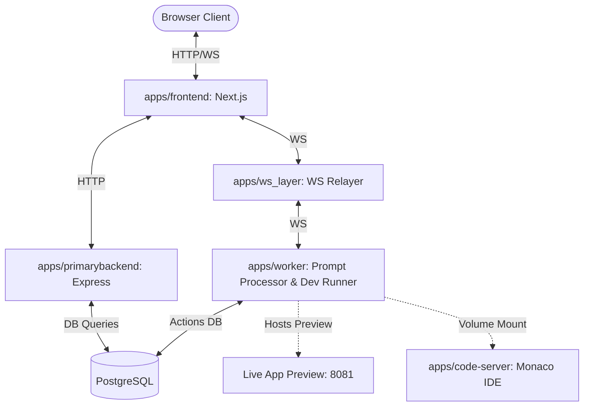

# Boltapp Monorepo - AI Code Generator (Bolt.new Clone)

A high-performance, full-stack monorepo clone of Bolt.new / Bolt.diy. This platform allows users to describe web applications in plain English, generates the source code using Gemini, launches a fully containerized workspace, hosts an embedded VS Code editor (code-server), and runs a live preview server on host port `8081`.

---

## 🏗 System Architecture

The codebase is organized as a Turbopack/npm workspaces monorepo:



### 1. Applications (`apps/`)

*   **[frontend](file:///Users/rahulchaudhary/cohort/devops/boltapp/apps/frontend)**: Next.js App Router UI featuring:
    *   Clerk Authentication.
    *   Interactive chat window for submitting prompts and showing real-time file creation logs.
    *   Embedded Code Editor running VS Code (via `code-server`).
    *   Responsive, live preview container mapping directly to the generated app's dev server.
*   **[primarybackend](file:///Users/rahulchaudhary/cohort/devops/boltapp/apps/primarybackend)**: Express.js server providing REST APIs for project creation, loading conversation history, and project details.
*   **[ws_layer](file:///Users/rahulchaudhary/cohort/devops/boltapp/apps/ws_layer)**: WebSocket relayer bridging real-time communication events between the client and the worker execution context.
*   **[worker](file:///Users/rahulchaudhary/cohort/devops/boltapp/apps/worker)**: Node.js container handling LLM generation execution:
    *   Streams prompt responses from Google Gemini.
    *   Processes file artifacts (creates, updates, deletes files).
    *   Executes shell commands sequentially inside the project workspaces.
    *   Hosts the active development servers on port `8081`.
*   **[worker-orchestrator](file:///Users/rahulchaudhary/cohort/devops/boltapp/apps/worker-orchestrator)**: Auto-scaling service for AWS Auto Scaling Groups (ASG) designed to scale remote `code-server` instances.

### 2. Shared Packages (`packages/`)

*   **[db](file:///Users/rahulchaudhary/cohort/devops/boltapp/packages/db)**: Prisma ORM configurations and shared PostgreSQL database client wrapper.
*   **[redis](file:///Users/rahulchaudhary/cohort/devops/boltapp/packages/redis)**: Shared Redis client initialization package.
*   **[ui](file:///Users/rahulchaudhary/cohort/devops/boltapp/packages/ui)**: Shared stub React UI components library.
*   **eslint-config / typescript-config**: Linting and compiler setups unified across packages.

---

## 🔌 Port Mappings & Services

The system is deployed containerized via Docker. Below is the mapping of host-accessible endpoints:

| Service | Port (Container) | Port (Host) | Description |
| :--- | :---: | :---: | :--- |
| **frontend** | `3000` | **`3002`** | Next.js User Interface |
| **primary-backend** | `3000` | **`3000`** | Project & Database APIs |
| **ws-relayer** | `9093` | **`9093`** | WebSocket relayer server |
| **worker** (API) | `9091` | **`9091`** | Prompts runner API |
| **worker** (Preview) | `8081` | **`8081`** | Live preview of generated applications |
| **code-server** | `8080` | **`8080`** | Embedded VS Code Web Interface |
| **postgres-db** | `5432` | **`5433`** | PostgreSQL DB Instance |
| **redis-db** | `6379` | **`6380`** | Redis Caching Instance |

---

## 🚀 Getting Started

### Prerequisites

*   Docker & Docker Compose.
*   Node.js (v18+) & Bun package manager (optional, for running locally).
*   A Gemini API Key.

### 🛠 Deployment with Docker Compose

1.  Create/Configure your environment variables in the `.env` configuration files.
2.  Start the entire stack:
    ```bash
    docker compose up -d
    ```
3.  Rebuild images if you make changes in the local code:
    ```bash
    docker compose up -d --build
    ```
4.  Open [http://localhost:3002](http://localhost:3002) in your browser to access the application.

---

## 🔧 Internal Features & Fixes implemented

1.  **Safety in Command Chains**: Updated the command processor inside the worker (`os.ts`) to execute chained commands (e.g., `npm install && npm run dev`) sequentially instead of concurrently. The script now waits for the previous command in the chain to exit with status `0` before proceeding, preventing build errors like `next: not found`.
2.  **Boilerplate Template Initializer**: The worker now pre-populates all new workspace directories on creation with corresponding baseline files (like `app/layout.tsx` for Next.js, or `package.json` for React/Vite) before the AI edits it, avoiding issues such as missing root layouts.
3.  **Google Fonts Turbopack Fix**: Removed `next/font/google` references from Next.js template layouts to fix compilation crashes associated with turbopack font resolutions in Docker containers.
